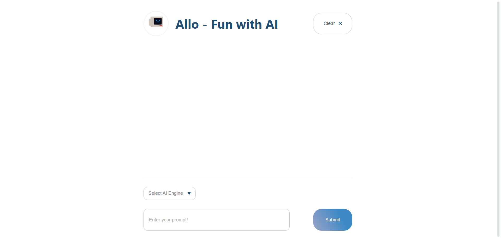
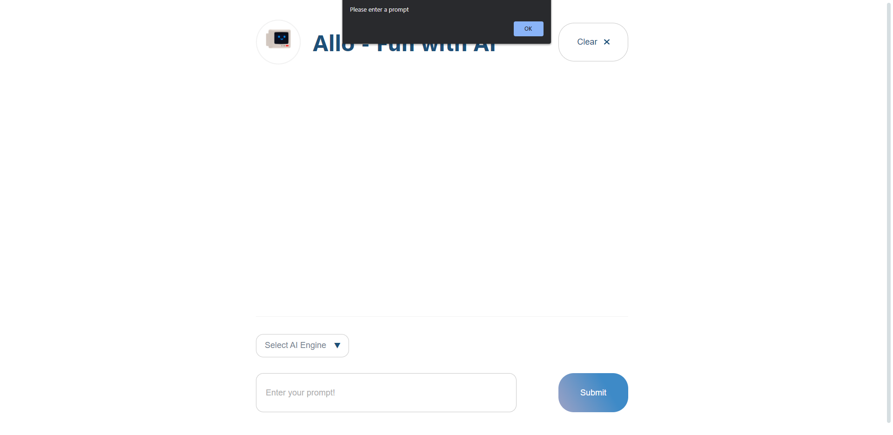
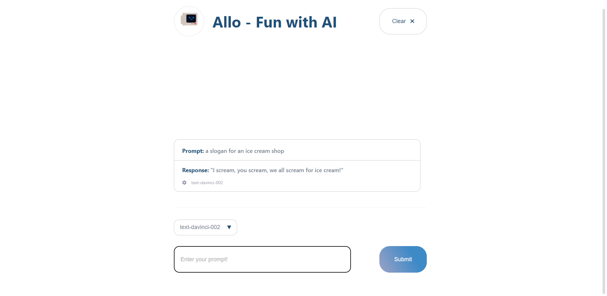
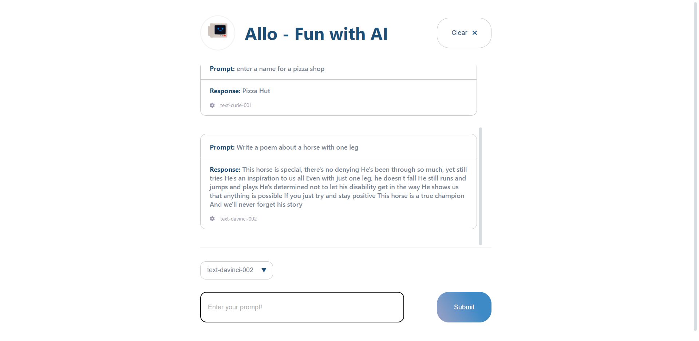
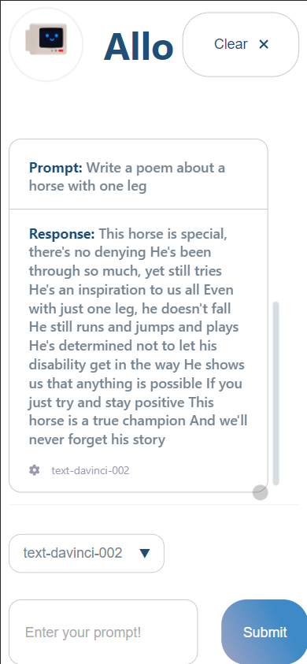

# Allo - Fun with AI: Shopify 2022 Frontend Challenge

Meet Allo, an AI that can process plain text prompts and produce outputs which you'll have trouble distinguishing from human writing. This project uses GPT-3, a powerful AI model created by OpenAI. The purpose of this project is for the Shopify Fall 2022 Front End Developer Intern Challenge.

View the deployed app here: https://allo-ai.netlify.app/

Project Description: Users can go on Allo and ask the AI an assortment of prompts, ranging from "Create a slogan for an icecream store" to "Write a poem about a one legged horse". Users have the ability to choose from 4 different AI Engines. Each engine has different strengths including speed, capabilities, and cost. The app was built using ReactJS using functional components and context api for state management.

The features of the app include:
- Ask the OpenAI API a prompt and display the output
- List the outputs from newest to oldest
- Both the original prompt and the output are displayed

Additional features which I added include:
- Ability to choose from different AI Engines
- An alert stops the user if they haven't specified an engine or written a prompt
- The list is stored in local storage and is displayed once again if the user exits the browser or refreshes 
- The list states which AI Engine was used for that prompt
- Ability to clear local storage with a button

Some features I would like to include if I had more time:
- Adding animations and transitions
- Loading screen while the API request is happening
- Unit testing
- Ability for user to choose how random the results are

## Local Build
### `npm start`

Runs the app in the development mode.\
Open [http://localhost:3000](http://localhost:3000) to view it in the browser.

The app without any prompts:

The app when you submit without entering a prompt:

The app with one prompt:

The app with multiple prompts:

The app on a mobile device:

<<<<<<< HEAD
=======

>>>>>>> 2d8240f270987f07ff6683a740797782f854fcbf
